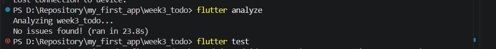

# Week 3 - Navigation & State Management
## Tujuan

Aplikasi ini dibuat untuk mempraktikkan:

- navigasi multi-halaman dengan GoRouter (path parameter dan perbedaan `go` dengan `push`);
- state management dengan Riverpod (`Notifier`, `ConsumerWidget`, `ref.watch` dan `ref.read`);
- penanganan state asinkron dengan `AsyncValue` (loading, error, success);
- verifikasi kode hasil AI dan pengujian dengan `flutter test`.

## Fitur utama

| Fitur | Penjelasan | File utama |
|---|---|---|
| Daftar ToDo | Tambah, centang selesai, dan hapus tugas. State dikelola `TodoListNotifier` dan tidak pernah diubah langsung | `lib/providers/todo_provider.dart`, `lib/pages/todo_page.dart` |
| Daftar Produk | Data dimuat secara asinkron dengan `AsyncNotifier`, menampilkan loading, error (tombol Coba lagi), dan data | `lib/providers/products_provider.dart`, `lib/pages/product_page.dart` |
| Statistik (AI Challenge) | Halaman statistik dengan simulasi gagal 30%, dibuat dengan bantuan AI lalu diverifikasi dan diperbaiki | `lib/providers/stats_provider.dart`, `lib/pages/stats_page.dart` |

## Struktur folder

```
03-week-3-navigation-state-management/
├── README.md
├── lib/
│   ├── main.dart
│   ├── pages/
│   │   ├── todo_page.dart
│   │   ├── product_page.dart
│   │   └── stats_page.dart
│   └── providers/
│       ├── todo_provider.dart
│       ├── products_provider.dart
│       └── stats_provider.dart
├── test/
│   └── stats_notifier_test.dart
├── docs/
└── screenshots/
```

## Cara menjalankan

```
flutter pub get
flutter run
```

Pengujian dan analisis kode:

```
flutter analyze
flutter test
```

## Hasil yang dicapai
screenshots/

## AI Challenge

### 1. Prompt yang digunakan

```
Buatkan halaman Flutter bernama StatsPage menggunakan flutter_riverpod.
Requirements:
- ConsumerWidget dengan satu AsyncNotifierProvider yang mensimulasikan
  pengambilan data statistik (delay 2 detik, kadang gagal 30%).
- UI harus menangani loading (spinner), error (pesan + tombol retry),
  dan success (ListView 3 item).
- Berikan unit test untuk notifier-nya.
Jelaskan setiap bagian kode dalam komentar.
```

### 2. Output awal AI

Tiga file hasil AI sebelum diubah disimpan di `docs/`:

- `docs/ai-output/stats_provider.dart`
- `docs/ai-output/stats_page.dart`
- `docs/ai-output/stats_notifier_test.dart`

Ringkasan: `StatsNotifier` menerima fungsi acak dan durasi lewat konstruktor agar bisa dikendalikan di test, `StatsPage` memakai `when` untuk tiga kondisi, dan test memeriksa kasus sukses serta gagal.

### 3. Hasil AI Verification Checklist

| Poin checklist | Hasil | Keterangan |
|---|---|---|
| State diubah secara immutable | Lolos | Tidak ada `state.add()` atau mutasi list. Data dikembalikan sebagai list `const` |
| `ref.watch` hanya di `build`, `ref.read` di callback | Lolos | `watch` ada di `build`. Tombol Coba lagi memanggil `ref.invalidate` di dalam callback |
| Ketiga state `AsyncValue` ditangani | Lolos di kode, bermasalah di praktik | `when` memuat loading, error, dan data. Namun layar error hampir tidak muncul karena retry otomatis (lihat temuan 1) |
| Provider bertipe eksplisit dan tidak duplikat | Lolos | `AsyncNotifierProvider<StatsNotifier, List<StatItem>>`, tidak ada nama ganda |
| Tidak memakai API Riverpod lama | Lolos | Memakai `AsyncNotifier` dan `ConsumerWidget`, tanpa `StateProvider` atau `StateNotifierProvider` |
| `flutter analyze` dan `flutter test` lolos |  | |
