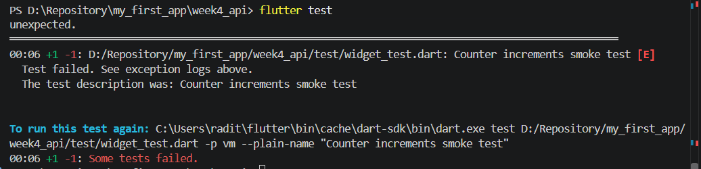
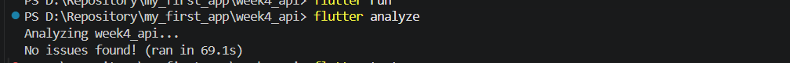

# Week 4: REST API dengan Dio dan Riverpod

Aplikasi Flutter yang mengambil data dari JSONPlaceholder (`/posts` dan `/comments`)
menggunakan Dio, repository pattern, dan Riverpod (`AsyncNotifier`), lengkap dengan
penanganan error ramah pengguna dan pagination.

## Cara menjalankan

```bash
flutter pub get
flutter run
flutter test
```

## Hasil verifikasi kode (review kode buatan AI)

| # | Poin verifikasi | Hasil | Catatan |
|---|-----------------|-------|---------|
| 1 | UI memanggil Dio langsung? | Tidak | Dio hanya ada di `api_client.dart` dan repository. UI hanya memakai provider (`ref.watch`). Alur: repository → provider → UI. |
| 2 | `fromJson` aman null? | `Comment` aman, `Post` awalnya tidak | `Comment` memakai guard `is`. `Post` memakai `as String? ?? ''` yang aman untuk null tetapi crash (`TypeError`) bila tipe salah. Sudah diperbaiki dengan guard `is`. |
| 3 | Semua `DioExceptionType` dipetakan? | Ya, dengan perbaikan | Timeout, `connectionError`, dan `badResponse` sudah dipetakan. Ditambahkan `cancel` dan `badCertificate`. Pesan teknis mentah di fallback akhir diganti pesan umum. |
| 4 | `baseUrl`/timeout terpusat? | `baseUrl` ya, timeout awalnya tidak | `CommentRepository` mengulang timeout 10 detik per-request. Duplikasi dihapus, timeout kini hanya di `createDio()`. |
| 5 | Test menguji field hilang? | Ya, tetapi terbatas | Test AI hanya menguji `fromJson({})`. Ditambahkan happy path serta edge case nilai `null`, tipe salah, dan angka desimal, juga test tipe salah untuk `Post`. |


## Temuan tambahan

- Ada komentar berbahasa Vietnam di `providers.dart`; diganti ke bahasa Indonesia agar konsisten.
- Cabang `code == 500` pada `friendlyErrorMessage` hampir identik dengan fallback `badResponse`, jadi redundan.
- Nilai default `0` dan `''` mencegah crash tetapi dapat menyembunyikan data rusak
  (misalnya `id: 0`). Untuk aplikasi produksi, pertimbangkan validasi tambahan.

## Edge case tambahan buatan sendiri

1. Nilai `null` eksplisit pada semua field `Comment`.
2. Tipe data salah (string pada field angka, angka pada field string, dan sebagainya).
3. Angka desimal pada field `int`.
4. Tipe salah pada `Post` (menemukan celah pada cast `as String?`).
